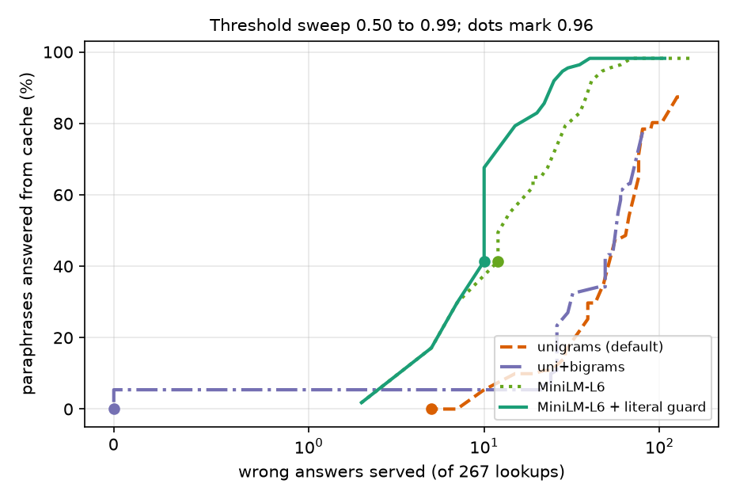
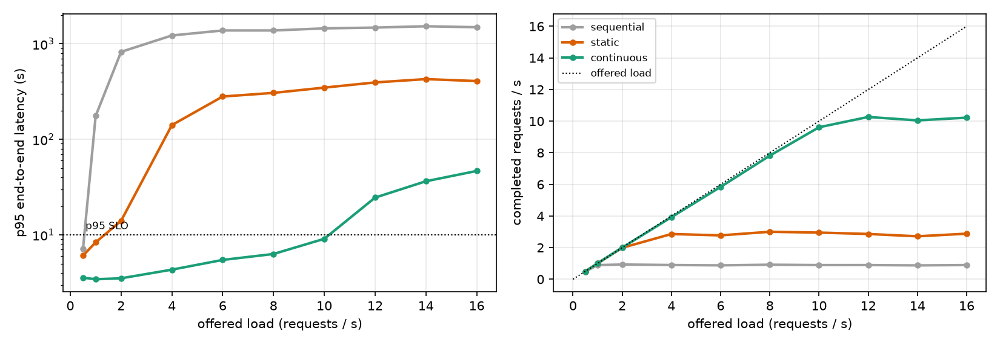

# InferenceLab

[](https://github.com/asher0913/inference-lab/actions/workflows/ci.yml)

[](LICENSE)

A serving front end for LLMs: a semantic response cache, single-flight request coalescing and an
async dynamic batcher, in front of any OpenAI-compatible server (vLLM, SGLang, Ollama). It comes
with three experiments:

- a load test of the front end;
- a labelled evaluation of whether the semantic cache serves the **right** answer;
- a discrete-event simulation of why continuous batching beats the static batching this front
  end does.

```text
request ─► semantic cache ─► in-flight map (coalesce identical prompts) ─► dynamic batcher ─► backend
            TTL · LRU · threshold · guard                                   max batch · max wait   vLLM / SGLang / Ollama / stub
```

## Results

### Request coalescing: 16 backend generations become 3

80 requests over 4 prompts (3 distinct), 16 in flight at a time, batches of up to 8 with a 6 ms
window. The backend is the deterministic stub (12 ms + 3 ms per item), so the counts are exact
and the latencies describe the front end, not a model.

| | Backend generations | Backend batches | Cache hits | Coalesced | p95 latency (stub) |
|---|---:|---:|---:|---:|---:|
| cache + batcher | 16 | 2 × 8 | 80% | 0 | ~76 ms |
| **+ single-flight coalescing** | **3** | 1 × 3 | 80% | 13 | ~31 ms |

The first 16 requests all arrive before any answer is cached, so without coalescing they all go
to the backend: 13 of those generations duplicate work already in flight. The in-flight map makes
identical prompts wait for the leader's result, and the leader's errors reach them too.

### Semantic caching serves wrong answers

37 of 76 base prompts from five families are cached. Then 267 lookups are made: paraphrases of
the cached prompts, which should hit, and prompts whose answer is not cached, which should miss.
Some of the second kind are near-misses that change the answer while barely changing the text:
swapped units, another language or country, a negation.



| Embedder | Hit rate at 0.96 | Wrong answers at 0.96 | Best hit rate with no wrong answers | With a per-family threshold |
|---|---:|---:|---:|---:|
| hashed unigrams (the default) | 0% | 5 | none | 0% |
| hashed uni+bigrams | 0% | 0 | 5.4% | 5.4% |
| MiniLM-L6 sentence embeddings | 41.4% | 12 | none | 56.8% |
| **MiniLM-L6 + literal guard** | 41.4% | 10 | none | **67.6%**, unit conversion exact-match only |

- **Embeddings cannot see argument order.** "convert 5 km to miles" and "convert 5 miles to km"
  have identical bags of words, and MiniLM rates them 0.987 similar, higher than a true
  paraphrase ("how many miles is 5 km", 0.883). No threshold makes unit conversion safe with
  either embedder; all 10 of MiniLM's remaining wrong answers are swapped conversions.
- **Lexical embeddings are useless in both directions.** At 0.96 the default cache answers no
  paraphrase and still serves 5 wrong answers. Lowering the threshold enough to answer half the
  paraphrases serves 50 or more wrong answers.
- **A literal guard fixes negation, not order.** Reusing an answer only when numbers, quoted text
  and negation words agree removes MiniLM's two negation errors ("foods that do not contain
  gluten" answered as "foods that contain gluten").
- **Per-family thresholds make it safe.** Enable semantic matching per prompt family, each with
  its own threshold, and keep exact matching for families no threshold makes safe. That serves
  67.6% of paraphrases with no wrong answers. The thresholds were chosen on this set, so a real
  deployment needs its own labelled traffic to set them.

The MiniLM rows need `pip install -e '.[neural]'` and a model download, so they are regenerated
offline (`inference-lab cache-eval`). CI regenerates and checks the lexical rows.

### Continuous batching: 10× the load within the same latency SLO

The dynamic batcher here does **static** batching: it forms a batch, runs it until the longest
output is done, and returns every result together. vLLM and SGLang schedule per decode step
instead. The cost of the difference is simulated on one accelerator: Poisson arrivals,
log-normal prompt (median 300 tokens) and output (median 120 tokens) lengths, and up to 32
sequences in a batch. A decode step costs 6 ms + 0.25 ms per sequence, and prefill costs
0.05 ms per prompt token. The cost model is illustrative, not calibrated to a particular GPU.
Each point is 1,500 requests averaged over 3 seeds.



| Offered load | Sequential p95 | Static p95 | Continuous p95 | Static slot utilisation |
|---:|---:|---:|---:|---:|
| 1 req/s | 176 s (overloaded) | 8.3 s | 3.4 s | 60% |
| 2 req/s | overloaded | 14.0 s | 3.5 s | 36% |
| 8 req/s | overloaded | overloaded (3.0 req/s done) | 6.3 s | 24% |
| 10 req/s | overloaded | overloaded | 9.1 s | 24% |

- **Highest load with p95 latency under 10 s:** 0.5 req/s sequential, 1 req/s static, 10 req/s
  continuous. Peak output throughput is about 157, 520 and 1,800 tokens/s.
- **Static batching wastes three quarters of the batch at load.** Output lengths are skewed, so
  most sequences finish long before the longest one. Their slots sit idle while it finishes, and
  short requests wait for long ones. Continuous batching refills a slot on the next step.
- **The batching window hardly matters for LLMs.** A 6 ms wait is noise next to seconds of
  decoding. The batcher's window matters for fast, fixed-cost models; for generation, the win is
  in the scheduler. That is why this front end sends batches as concurrent requests and leaves
  scheduling to the server when the backend is vLLM or SGLang.

## Usage

```bash
pip install -e '.[dev]'

inference-bench                                   # the load test (stub backend)
inference-bench --no-coalesce
inference-bench --base-url http://localhost:8000 --model Qwen/Qwen2.5-1.5B-Instruct   # a real vLLM/SGLang server
inference-lab report --out results                # simulation, lexical cache evaluation, load-test counts
pip install -e '.[neural]' && inference-lab cache-eval    # adds the MiniLM rows
python scripts/make_figures.py                    # needs matplotlib
uvicorn inference_lab.api:app                     # POST /v1/generate
```

```python
from inference_lab.backend import OpenAICompatibleBackend
from inference_lab.cache import SemanticCache
from inference_lab.embedding import SentenceTransformerEmbedder, literal_guard
from inference_lab.service import InferenceService

service = InferenceService(
    OpenAICompatibleBackend("http://localhost:8000", "Qwen/Qwen2.5-1.5B-Instruct"),
    cache=SemanticCache(threshold=0.9, embedder=SentenceTransformerEmbedder(), guard=literal_guard),
)
```

Throughput and latency from the stub backend are **not** LLM performance claims. For numbers
against a real server, record the model, accelerator, prompt and output length distributions,
warm-up, cache threshold and at least three repeated runs.

## Tests

`pytest -q` runs 14 tests:

- batching combines concurrent requests, the cache skips the backend on a repeat, and a burst of
  identical prompts costs one generation (sixteen without coalescing);
- waiters see the leader's error;
- TTL and LRU eviction work;
- unigram hashing is blind to word order and bigrams are not, and the literal guard works;
- the cache-evaluation headline holds;
- the simulation keeps its ordering, its padding waste, and sequential equal to batch size 1;
- the OpenAI-compatible adapter sends one request per prompt;
- the load-test counts and the HTTP API work.

## Limitations

- Batching is simulated, not measured on a GPU. Chunked prefill, KV-cache capacity, preemption
  and prefix caching are not modelled; see `tiered-kv-cache-lab` for the KV side.
- The cache evaluation is templated. Real traffic has longer prompts, context-dependent answers
  and paraphrases no template anticipates.
- The in-flight map coalesces exactly equal prompts (after case and whitespace normalisation),
  not semantically similar ones, which would carry the same risks as the cache.

## License

MIT
